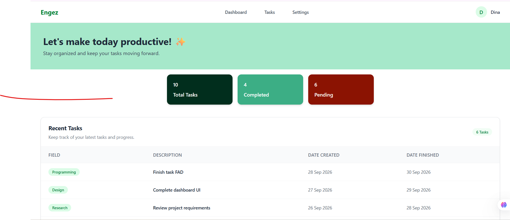

````md
# Engez

A simple and responsive task management dashboard built with React, TypeScript, and Tailwind CSS.

## Preview

--- 

## Features

- Responsive dashboard layout
- Task overview with:
  - Total tasks
  - Completed tasks
  - Pending tasks
- Recent tasks table
- Responsive navigation bar
- Mobile navigation menu
- Reusable React components
- Clean and minimal user interface

## Tech Stack

- React
- TypeScript
- Tailwind CSS
- React Router
- Vite

## Project Structure

```text
src/
├── components/
│   ├── Card.tsx
│   ├── HeroSection.tsx
│   ├── Navbar.tsx
│   └── TaskList.tsx
│
├── pages/
│   └── DashboardPage.tsx
│
└── ...
````

## Getting Started

### Clone the repository

```bash
git clone YOUR_REPOSITORY_URL
```

### Navigate to the project

```bash
cd simple-dashboard_page
```

### Install dependencies

```bash
npm install
```

### Run the development server

```bash
npm run dev
```

## Future Improvements

* Add task creation and editing
* Add task deletion
* Add task filtering and sorting
* Add authentication
* Connect the application to a backend API
* Store tasks in a database

## Author

Dina Tarek

```
```
